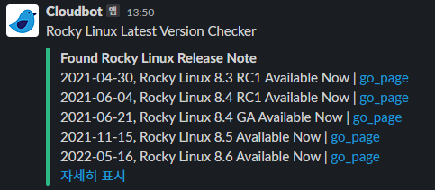

# Rocky Linux Latest Version Checker
이 체커는 Rocky Linux 최신 버전이 릴리즈가 되었는지 확인하고 알람을 하는 체커이다.

# Requirement
```
python3
feedparser
mariadb==1.0.11
requests
```

# 배포
Kubernetes 위에서 Cronjob 으로 작동하며, 매일 9 AM 에 Job 을 수행한다.
상세한 배포 방법은 아래 [문서](/kustomize/README.md) 를 확인한다.

# Build
Container Image Build 는 아래와 같이 수행한다.
```bash
docker build -t rlchecker .
```

# Example

